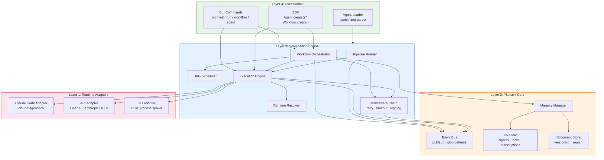
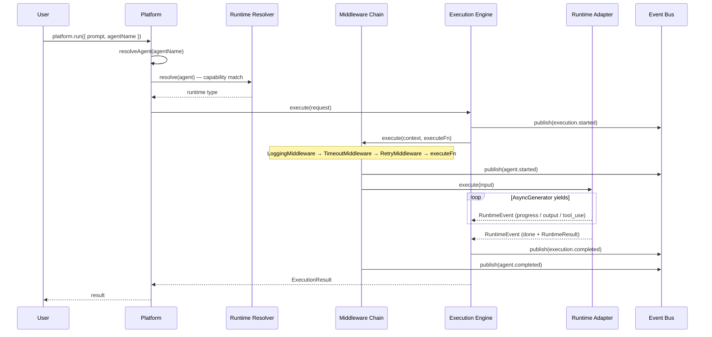
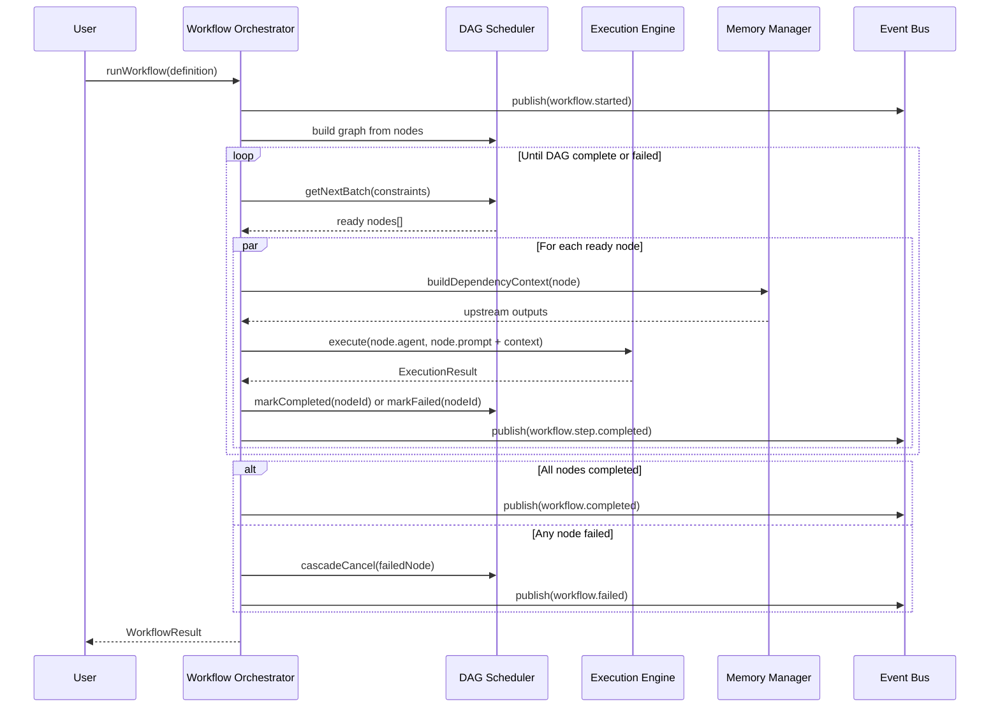
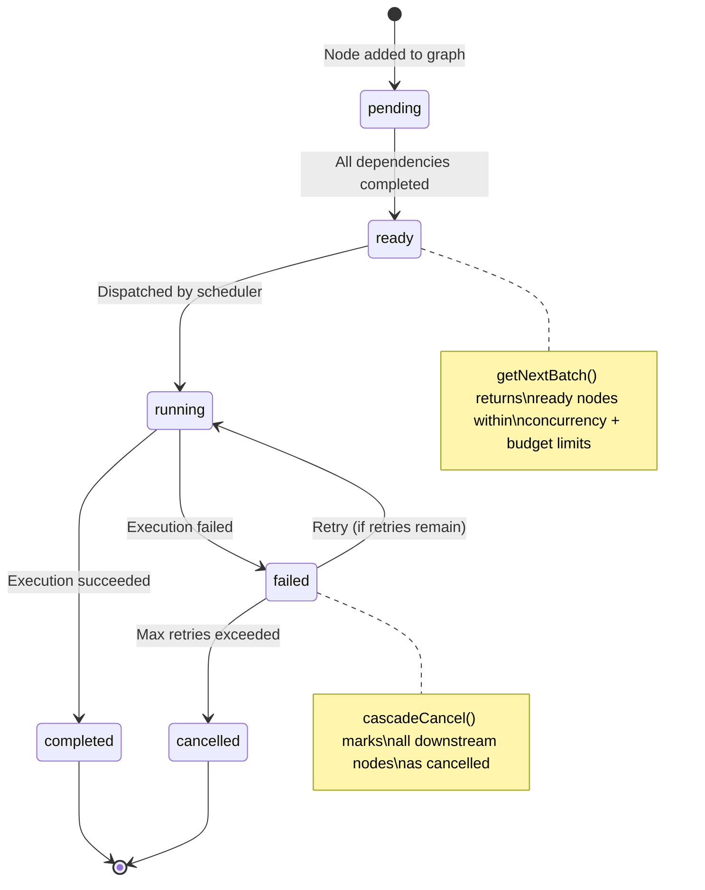
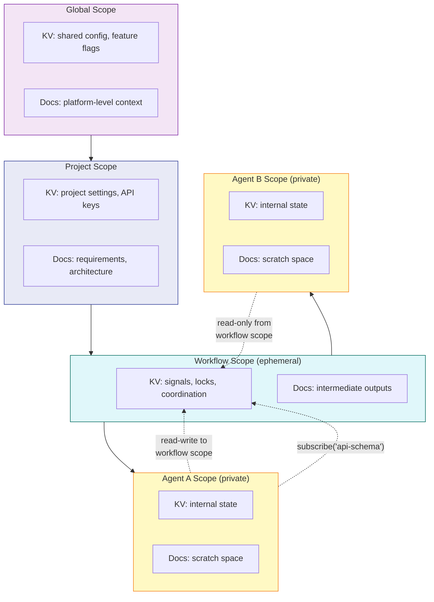
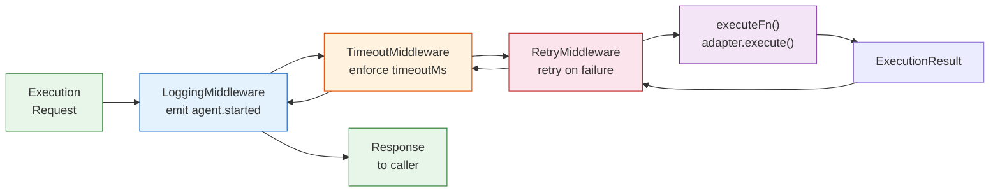
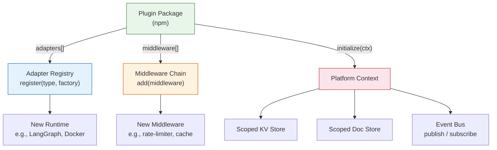
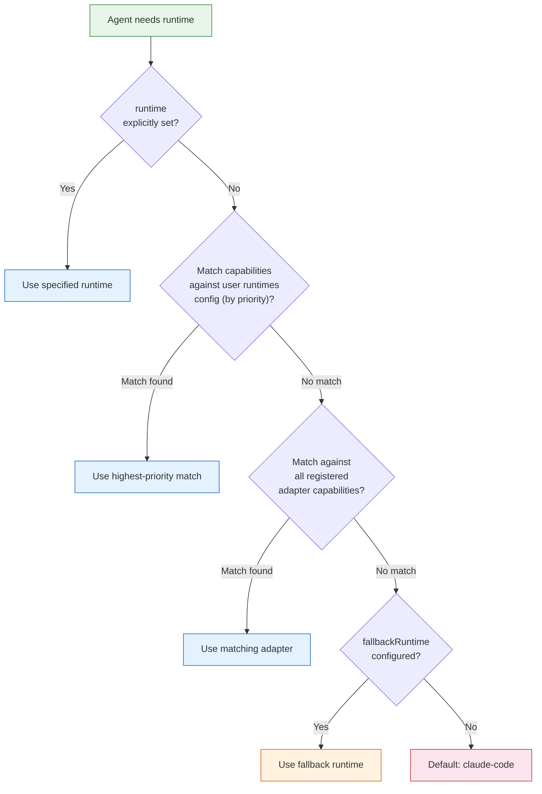

# Platform Architecture

> Universal AI agent platform -- compose any harness, API, framework, or CLI tool into workflows with shared memory, scheduling, and observability.

## Vision

A platform where users compose heterogeneous runtimes (Claude Code, Copilot, Aide, OpenCode, V0, LangChain, AutoGen, Docker, kubectl, raw API calls) into whatever they want. The platform provides the connective tissue: shared memory, context, scheduling, composition, and optimization.

Users can:
- **Code agents** from scratch using the SDK (TypeScript)
- **Write descriptive agents** as `.md` files that the platform interprets and executes
- **Define agents** via `agent.yaml` config files with sensible defaults
- **Wrap framework agents** (LangGraph, AutoGen, CrewAI) as platform-managed runtimes
- **Merge external agents** -- trigger and coordinate agents hosted elsewhere
- **Extend everything** -- swap schedulers, memory backends, middleware, adapters via plugins

The platform is open-source. Users can customize shared memory optimizers, token usage optimizers, or any platform component.

---

## Settled Design Decisions

| # | Decision | Answer |
|---|----------|--------|
| 1 | Scope | Ground-up re-architecture of the orchestrator into a universal platform |
| 2 | Persona | Universal -- anyone building with AI, not narrowed to a single use case |
| 3 | Platform type | Both runtime and SDK, open-source, users extend at every layer |
| 4 | Core owns | Context/Memory + Scheduling + Composition. Execution, Observation, Optimization are pluggable. |
| 5 | Runtime adapter | Uniform async interface (`initialize`, `execute`, `cancel`, `status`) with pluggable transports (in-process, stdio, HTTP) |
| 6 | Shared memory | Layered: KV store (fast coordination, locks, signals) + Document store (rich context, requirements, architecture) |
| 7 | Language | TypeScript for v1, protocol-first north star (define interfaces as protocols so polyglot SDKs are possible later) |
| 8 | Composition | DAG + pipeline + event-driven, all first-class patterns |
| 9 | Extension model | Plugins (new capabilities: adapters, backends) + Middleware (modify behavior: caching, optimization, routing) |
| 10 | User config | YAML for simple cases, TypeScript code for complex ones, `.md` descriptive agents, scaffolding wizard |
| 11 | Agent abstraction | An agent is a `RuntimeAdapter` + config. Statefulness is an adapter concern, not a platform distinction. |
| 12 | Context scopes | Four levels: global / project / workflow / agent |
| 13 | Scheduling | Pluggable. Default is concurrency-limited with basic cost budgets. Interface: `getNextBatch(readyTasks, slots, constraints) → tasks` |
| 14 | Scaffolding | Template gallery for known patterns + interactive CLI prompts for custom setups |
| 15 | Runtime assignment | Capability matching + user-configurable preference order |
| 16 | Cross-harness comms | Shared memory + event notifications (no direct agent-to-agent messaging) |
| 17 | Code agent SDK | Fluent builder + observer pattern: `Agent.create().runtime().on().build()` |
| 18 | Multi-step `.md` agents | Explicit `## Steps` section if provided; planner fallback (low-cost model) if not |
| 19 | Plugin distribution | npm packages, no custom registry |
| 20 | `.md` agent format | Frontmatter (identity + preferences) + body (instructions + optional structured sections) |
| 21 | `agent.yaml` format | Only `name` required, everything else optional with sensible defaults |
| 22 | Codebase strategy | Reshape what fits, rewrite what's coupled, checkpoint after each milestone |

---

## Four-Layer Architecture

```
┌─────────────────────────────────────────────────────────────┐
│                    LAYER 4: USER SURFACE                    │
│                                                             │
│  CLI Commands         SDK (TypeScript)      Agent Loader    │
│  orch init            Agent.create()        .yaml parser    │
│  orch run             Workflow.create()     .md parser      │
│  orch workflow run    Events constants      frontmatter     │
│  orch agent list                                            │
│  orch status                                                │
└──────────────────────────┬──────────────────────────────────┘
                           │
┌──────────────────────────▼──────────────────────────────────┐
│              LAYER 3: COMPOSITION ENGINE                     │
│                                                             │
│  ┌──────────────┐  ┌──────────────┐  ┌───────────────────┐ │
│  │     DAG      │  │   Pipeline   │  │    Workflow       │ │
│  │  Scheduler   │  │    Runner    │  │   Orchestrator    │ │
│  └──────┬───────┘  └──────┬───────┘  └────────┬──────────┘ │
│         └─────────────────┼────────────────────┘            │
│                           ▼                                 │
│              Execution Engine                               │
│              (dispatch, streaming, lifecycle)                │
│                                                             │
│  ┌────────────────────┐  ┌──────────────────────────┐      │
│  │  Runtime Resolver  │  │    Middleware Chain       │      │
│  │  (capability match │  │  (retry, timeout, logging │      │
│  │   + preferences)   │  │   + custom middleware)    │      │
│  └────────────────────┘  └──────────────────────────┘      │
└──────────────────────────┬──────────────────────────────────┘
                           │
┌──────────────────────────▼──────────────────────────────────┐
│                 LAYER 2: PLATFORM CORE                       │
│                                                             │
│  ┌──────────────────────┐  ┌────────────────────────────┐  │
│  │   Memory Subsystem   │  │       Event Bus             │  │
│  │                      │  │   (pub/sub, wildcards,      │  │
│  │  KV Store            │  │    once, waitFor)           │  │
│  │  (signals, locks,    │  └────────────────────────────┘  │
│  │   coordination,      │                                   │
│  │   subscriptions)     │  ┌────────────────────────────┐  │
│  │                      │  │    Memory Manager           │  │
│  │  Document Store      │  │   (scoped handles,          │  │
│  │  (context, reqs,     │  │    read-only enforcement,   │  │
│  │   versioned docs)    │  │    workflow cleanup)         │  │
│  │                      │  └────────────────────────────┘  │
│  │  Scopes:             │                                   │
│  │  global / project /  │                                   │
│  │  workflow / agent    │                                   │
│  └──────────────────────┘                                   │
└──────────────────────────┬──────────────────────────────────┘
                           │
┌──────────────────────────▼──────────────────────────────────┐
│              LAYER 1: RUNTIME ADAPTERS                       │
│                                                             │
│  Uniform Interface:                                         │
│    initialize(config) → ready                               │
│    execute(input) → AsyncGenerator<RuntimeEvent>            │
│    cancel() → stopped                                       │
│    status() → RuntimeState                                  │
│                                                             │
│  ┌──────────────┐  ┌──────────────┐  ┌──────────────┐     │
│  │  Claude Code  │  │    API       │  │     CLI      │     │
│  │   adapter     │  │   adapter    │  │   adapter    │     │
│  │              │  │  (OpenAI,    │  │  (shell,     │     │
│  │  file-edit   │  │  Anthropic,  │  │   Docker,    │     │
│  │  shell, git  │  │  any HTTP)   │  │   kubectl)   │     │
│  └──────┬───────┘  └──────┬───────┘  └──────┬───────┘     │
│         │                 │                  │              │
│    @anthropic-ai/       HTTP fetch       child_process      │
│    claude-agent-sdk                      spawn              │
└─────────────────────────────────────────────────────────────┘
```

---

## Architectural Diagrams

### System Overview — Layer Dependency Flow



### Execution Flow — Single Agent Run



### Workflow Execution — DAG Orchestration



### DAG Scheduler — Node Lifecycle



### Memory Model — Scope Hierarchy



### Middleware Chain — Request Pipeline



### Plugin System — Extension Points



### Runtime Resolution — Decision Flow



---

## Implemented Directory Structure

```
src/
├── platform/
│   ├── types.ts                              # Core types: AgentDefinition, Scope, Middleware, Plugin
│   ├── platform.ts                           # Platform instance (wires all layers)
│   └── config/
│       ├── schema.ts                         # Zod schemas for platform.config.yaml
│       └── loader.ts                         # YAML loading + validation
│
├── layer1-adapters/
│   ├── types.ts                              # RuntimeAdapter interface, RuntimeEvent, RuntimeResult
│   ├── adapter-registry.ts                   # Adapter registration + factory (Claude Code, API, CLI)
│   ├── claude-code/
│   │   └── adapter.ts                        # Claude Code adapter (@anthropic-ai/claude-agent-sdk)
│   ├── api/
│   │   └── adapter.ts                        # Generic HTTP adapter (OpenAI + Anthropic formats)
│   └── cli/
│       └── adapter.ts                        # Shell command adapter (child_process spawn)
│
├── layer2-core/
│   ├── memory/
│   │   ├── types.ts                          # KVStore, DocumentStore, MemoryManager interfaces
│   │   ├── kv-store.ts                       # In-memory KV with 4-level scoping + subscriptions
│   │   ├── doc-store.ts                      # In-memory document store with versioning + search
│   │   └── memory-manager.ts                 # Scoped access, read-only enforcement, cleanup
│   └── events/
│       ├── types.ts                          # PlatformEvent, EventBus interface, EventTypes
│       └── event-bus.ts                      # Pub/sub with glob patterns (*, **), once, waitFor
│
├── layer3-engine/
│   ├── execution/
│   │   ├── types.ts                          # ExecutionRequest, ExecutionEngine interface
│   │   └── engine.ts                         # Dispatches to adapters, streams events
│   ├── composition/
│   │   ├── scheduler-interface.ts            # Pluggable Scheduler contract, WorkflowNode, NodeStatus
│   │   ├── dag-scheduler.ts                  # DAG with cycle detection, topological sort, critical path
│   │   ├── pipeline-runner.ts                # Sequential steps with {{previous}} interpolation
│   │   └── workflow-orchestrator.ts          # Drives DAG workflows: schedule → dispatch → collect
│   ├── middleware/
│   │   └── chain.ts                          # MiddlewareChain + RetryMiddleware + TimeoutMiddleware + LoggingMiddleware
│   └── runtime-resolver.ts                   # Capability matching + user preference order
│
├── layer4-surface/
│   ├── cli/
│   │   ├── index.ts                          # Command registration (init, run, status, workflow, agent)
│   │   └── commands/
│   │       ├── init.ts                       # orch init
│   │       ├── run.ts                        # orch run <prompt>
│   │       ├── status.ts                     # orch status
│   │       ├── workflow.ts                   # orch workflow run <file>
│   │       └── agent.ts                      # orch agent list / inspect / runtimes
│   ├── sdk/
│   │   ├── types.ts                          # AgentBuilder, AgentContext, Events constants
│   │   ├── agent-builder.ts                  # Agent.create('name').runtime().capability().build()
│   │   ├── workflow-builder.ts               # Workflow.create('name').step().parallel().build()
│   │   └── index.ts                          # Public SDK exports
│   └── agent-loader/
│       └── parser.ts                         # YAML + Markdown (.md frontmatter) agent parsers
│
├── cli/
│   ├── index.ts                              # Main CLI entry (platform commands + grill-me)
│   └── commands/
│       └── grill-me.ts                       # Socratic grilling session (standalone)
│
└── util/
    ├── errors.ts                             # Error hierarchy (OrchestratorError, CycleDetectedError, etc.)
    └── logger.ts                             # Pino logger

tests/unit/platform/
├── dag-scheduler.test.ts                     # 19 tests: DAG operations, scheduling, cycle detection
├── middleware.test.ts                        # 12 tests: chain, retry, timeout, logging
├── workflow-integration.test.ts              # 11 tests: full workflow with mock adapters
├── platform-integration.test.ts              # 11 tests: platform wiring, plugins, runtime resolution
├── doc-store.test.ts                         # 11 tests: document CRUD, versioning, search, scoping
├── kv-store.test.ts                          # 11 tests: KV CRUD, subscriptions, scoping
├── event-bus.test.ts                         # 10 tests: pub/sub, wildcards, once, waitFor
├── agent-builder.test.ts                     #  9 tests: fluent builder, memory, preferences
├── memory-manager.test.ts                    #  8 tests: scoped access, read-only, cleanup
├── workflow-builder.test.ts                  #  7 tests: workflow builder, validation
├── runtime-resolver.test.ts                  #  7 tests: capability matching, preference order
├── agent-parser.test.ts                      #  6 tests: YAML + markdown parsing
└── config-loader.test.ts                     #  6 tests: config schema validation
```

---

## SDK Contracts

### Agent Builder (Fluent API)

```typescript
import { Agent, Workflow, Events } from 'dev-orchestrator/sdk';

// Simple agent
const agent = Agent.create('backend-builder')
  .runtime('claude-code')
  .capability('file-edit', 'shell', 'git')
  .memory({ scope: 'workflow', access: 'read-write' })
  .preferences({ maxRetries: 3, timeoutMs: 600_000 })
  .description('Builds the backend API')
  .instructions('Implement RESTful endpoints')
  .on(Events.TASK_COMPLETE, handler)
  .adapterConfig({ model: 'claude-sonnet-4-6' })
  .build();
```

### Workflow Builder (Fluent API)

```typescript
const workflow = Workflow.create('full-stack-deploy')
  .step('plan', plannerAgent, 'Create implementation plan')
  .parallel([
    { name: 'frontend', agent: feAgent, prompt: 'Build React frontend' },
    { name: 'backend', agent: beAgent, prompt: 'Build Node.js API' },
  ], { dependsOn: ['plan'] })
  .step('deploy', deployAgent, 'Deploy to production', {
    dependsOn: ['frontend', 'backend'],
  })
  .constraints({ maxConcurrent: 3, maxBudgetUsd: 20 })
  .cwd('/workspace')
  .projectId('my-app')
  .build();
```

### Runtime Adapter Interface

```typescript
interface RuntimeAdapter {
  readonly type: string;
  readonly capabilities: string[];

  initialize(config: AdapterConfig): Promise<void>;
  execute(input: ExecutionInput): AsyncGenerator<RuntimeEvent, void, undefined>;
  cancel(): Promise<void>;
  status(): RuntimeState;
}

type RuntimeState = 'idle' | 'initializing' | 'running' | 'cancelled' | 'completed' | 'failed';

type RuntimeEvent =
  | { type: 'progress'; message: string; percent?: number; timestamp: string }
  | { type: 'output'; content: string; role: 'assistant' | 'system'; timestamp: string }
  | { type: 'tool_use'; tool: string; input: Record<string, unknown>; timestamp: string }
  | { type: 'error'; error: Error; recoverable: boolean; timestamp: string }
  | { type: 'done'; result: RuntimeResult; timestamp: string };
```

### Pluggable Scheduler Interface

```typescript
interface Scheduler {
  getNextBatch(
    readyNodes: WorkflowNode[],
    runningCount: number,
    constraints: SchedulerConstraints,
  ): WorkflowNode[];
}

interface SchedulerConstraints {
  maxConcurrent: number;
  maxBudgetUsd?: number;
  currentCostUsd?: number;
}
```

### Plugin Interface

```typescript
interface Plugin {
  name: string;
  version: string;
  initialize?(platform: PlatformContext): Promise<void>;
  adapters?: RuntimeAdapterFactory[];
  middleware?: Middleware[];
}
```

### agent.yaml Format

```yaml
# Required
name: frontend-builder

# Optional (all have sensible defaults)
description: "Builds React frontend from design specs"
runtime: api                          # Falls back to capability matching if omitted
capabilities: [text-generation]
memory:
  scope: workflow                     # global | project | workflow | agent
  access: read-only                   # read-only | read-write
  subscribe: [api-schema]             # KV keys to watch
preferences:
  fallback_runtime: claude-code
  max_retries: 2
  timeout: 300s
steps:
  - name: design
    description: Design the component architecture
  - name: implement
    description: Implement the components
    depends_on: [design]
triggers:
  on_event: backend-ready             # Start when this event fires
config:
  model: claude-sonnet-4-6            # Passthrough to adapter
```

### Descriptive .md Agent Format

```markdown
---
name: deploy-agent
runtime: claude-code
capabilities: [shell, file-edit]
---

# Deploy Agent

You are responsible for deploying the application to production.

## Steps

1. **Test**: Run the test suite and confirm all tests pass
2. **Build**: Build the Docker image
3. **Deploy**: Apply Kubernetes manifests
```

If `## Steps` is present, the platform creates a literal execution plan from the steps.
If absent, the platform uses the body as instructions for a single-step execution.

---

## Middleware Chain

Middleware wraps execution with cross-cutting concerns. Each middleware calls `next()` to continue the chain.

**Built-in middleware:**

| Middleware | Purpose |
|-----------|---------|
| `LoggingMiddleware` | Emits `agent.started` / `agent.completed` / `agent.failed` events |
| `TimeoutMiddleware` | Cancels execution if it exceeds `agent.preferences.timeoutMs` |
| `RetryMiddleware` | Retries failed executions up to `agent.preferences.maxRetries` times |

**Custom middleware:**

```typescript
const rateLimiter: Middleware = {
  name: 'rate-limiter',
  async execute(ctx, next) {
    await waitForSlot(ctx.agent.runtime);
    return next();
  },
};

platform.middlewareChain.add(rateLimiter);
```

---

## Memory System

### Two-Tier Model

| Tier | Purpose | Interface | Implementation |
|------|---------|-----------|---------------|
| **KV Store** | Fast coordination: signals, locks, small state | `get`, `set`, `delete`, `list`, `subscribe`, `subscribeAll` | In-memory with change notifications |
| **Document Store** | Rich context: requirements, architecture, API contracts | `get`, `set`, `delete`, `list`, `search` | In-memory with versioning |

### Scoping and Access Control

```typescript
// Agent gets its own private scope + workflow shared scope
const { kv, docs, workflowKv, workflowDocs } = memoryManager.createAgentMemory(
  'workflow-123',
  'agent-abc',
  'read-write',  // or 'read-only' for workflow stores
);

// Agent writes to its private scope
await kv.set('internal-state', 'processing');

// Agent writes to shared workflow scope (visible to other agents)
await workflowKv.set('api-schema', '{ "endpoint": "/users" }');

// Another agent subscribes reactively
workflowKv.subscribe('api-schema', (value, oldValue) => {
  console.log('Schema updated:', value);
});
```

---

## Event System

Glob-style pattern matching for event subscriptions:

```typescript
// Exact match
eventBus.subscribe('agent.completed', handler);

// Single-segment wildcard
eventBus.subscribe('agent.*', handler);  // matches agent.completed, agent.failed

// Multi-segment wildcard
eventBus.subscribe('workflow.**', handler);  // matches workflow.started, workflow.step.completed

// One-time handler
eventBus.once('workflow.completed', handler);

// Promise-based wait
const event = await eventBus.waitFor('agent.completed', 30_000);
```

**Well-known event types:**

| Event | Source |
|-------|--------|
| `agent.initialized`, `agent.started`, `agent.progress`, `agent.completed`, `agent.failed` | Middleware / Engine |
| `workflow.started`, `workflow.step.completed`, `workflow.completed`, `workflow.failed` | Orchestrator / Pipeline |
| `execution.started`, `execution.completed`, `execution.failed`, `execution.retrying` | Engine |
| `memory.kv.changed`, `memory.doc.updated` | Memory subsystem |

---

## Runtime Resolution

When an agent doesn't specify a runtime, the platform resolves one automatically:

1. **Explicit runtime** — Agent specifies `runtime: claude-code` → use it
2. **User preferences** — Match capabilities against `runtimes` in config (sorted by `priority`)
3. **Adapter capabilities** — Match against all registered adapters' declared capabilities
4. **Fallback runtime** — Agent's `preferences.fallbackRuntime`
5. **Default** — `claude-code`

```yaml
# platform.config.yaml
runtimes:
  - name: claude
    type: claude-code
    priority: 0
    capabilities: [file-edit, shell, git]
  - name: openai
    type: api
    priority: 1
    config: { base_url: "https://api.openai.com/v1" }
  - name: deployer
    type: cli
    priority: 2
    capabilities: [shell, deployment]
```

---

## Implementation Status

### Completed (M1–M4)

| Milestone | Components |
|-----------|-----------|
| **M1: Hello World** | Platform types, config schema, Claude Code adapter, KV store, event bus, execution engine, agent builder SDK, CLI (init/run/status) |
| **M2: Memory & Multi-Step** | DAG scheduler, pipeline runner, document store, memory manager, middleware chain (retry/timeout/logging), workflow orchestrator |
| **M3: Multi-Runtime** | API adapter, CLI adapter, agent parser (.yaml + .md), runtime resolver, workflow builder SDK |
| **M4: Platform** | Adapter registry (all 3 adapters), Platform class wiring, CLI commands (workflow/agent), plugin system |

**Total: 128 tests passing across 13 test files.**

### Not Yet Implemented

- Scaffolding wizard (`orch scaffold agent`)
- Agent template gallery
- Framework adapter (LangGraph/AutoGen)
- Web dashboard
- SQLite persistence for KV and document stores (currently in-memory)
- Agent merger (external hosted agents)
- `.md` planner fallback (low-cost model decomposition)
- npm package publishing (separate SDK + CLI packages)

---

## Interactive Diagrams

Interactive HTML diagrams are available in `.archify/`:

| Diagram | File | Description |
|---------|------|-------------|
| Platform Architecture | `.archify/architecture-platform-overview-20261006-120000/orchestrator-architecture.html` | Component overview across all 4 layers with boundaries and connections |
| Request Execution Workflow | `.archify/workflow-request-execution-20261006-120100/request-execution.html` | How a request flows from CLI through engine to runtime adapter |
| DAG Workflow Sequence | `.archify/sequence-dag-workflow-20261006-120200/dag-workflow-sequence.html` | Sequence of messages during DAG workflow execution |
| Memory & Events Dataflow | `.archify/dataflow-memory-events-20261006-120300/memory-events-dataflow.html` | Data flow between producers, transport, and consumers |
| Node State Lifecycle | `.archify/lifecycle-workflow-node-20261006-120400/workflow-node-lifecycle.html` | State transitions for workflow nodes (pending → running → completed/failed) |

Open any HTML file in a browser to explore the interactive diagram.

---

## Testing Strategy

- Each milestone produces a testable, end-to-end MVP
- Unit tests cover individual components (KV, events, DAG, middleware)
- Integration tests verify cross-layer wiring (workflow + engine + memory + events)
- Mock adapters replace real runtimes in tests (no subprocess spawning)
- All tests run via `npx vitest run` in under 2 seconds
